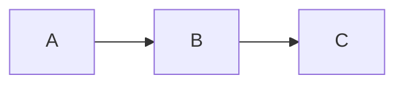

# Markdown 是双面镜子

今天在 HN best 上翻到一个 Obsidian 插件的截图，
作者把同一段文本的原始 Markdown 源和渲染视图叠在一起。
突然意识到：Markdown 之所以好用，不是因为语法简单，
是因为它把"文本"和"呈现"分成两面对称的镜子，
中间是同一个文件。

## 左面：源

```
# Hello
**bold** _italic_ `code`



数学
$$
e^{i\pi} + 1 = 0
$$
```

## 右面：渲染

同样的内容变成一篇带 H1、粗体斜体行内代码、
Mermaid 流程图、KaTeX 数学公式的杂志页。

## 中间：那根斜杠

按 ⌘/ 调出命令面板的那一瞬，
左面和右面是同一个东西，只是观察角度不同。
GitHub、Obsidian、Typora、Hugo、Notion、飞书文档都在做这件事——
文本是 single source of truth，渲染是它的镜像。

这就是 Markdown 三十年后还能打的原因：
它不是取代 Word，它是不让"源"和"呈现"再分开。